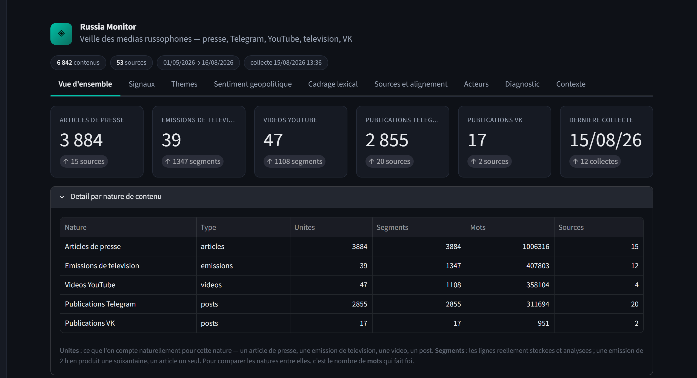
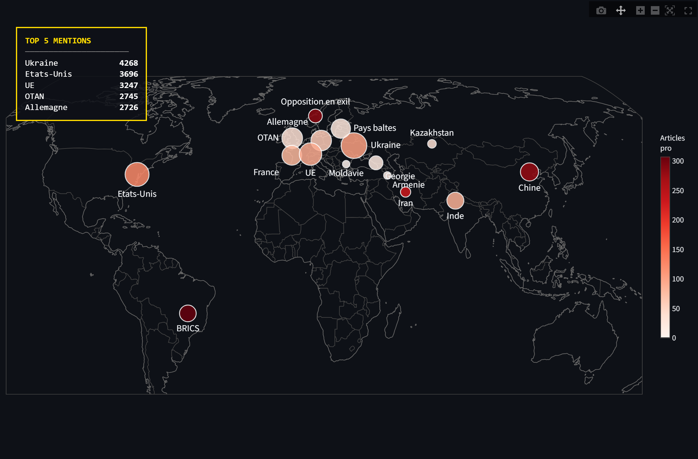

# Russia Monitor

Veille des médias russophones sur la Russie. L'outil collecte chaque jour la presse, les canaux Telegram, les émissions de télévision, les chaînes YouTube et les communautés VKontakte, les analyse avec un modèle de langage, et restitue le tout dans un tableau de bord.



Neuf onglets : volumes et couverture, signaux de rupture, thèmes, sentiment géopolitique, cadrage lexical, alignement éditorial des sources, auteurs, diagnostic de collecte, et un rappel du paysage médiatique russe.



La carte d'influence situe seize acteurs géopolitiques : taille selon le nombre de mentions, couleur selon le nombre d'articles favorables.

---

## Le corpus

| Nature | Sources | Collecte |
|---|---|---|
| Presse | 21 | RSS, ou lecture de la page d'accueil |
| Telegram | 20 | aperçu web public `t.me/s/` |
| Télévision | 14 | RuTube ou flux HLS, transcrits par Whisper |
| VKontakte | 5 | navigateur sans interface (*en développement*) |
| YouTube | 4 | sous-titres |

Chaque source porte, dans `config/sources.yaml`, un type de média (`etat`, `para_etat`, `independant`, `exil`), son statut légal en Russie et une note d'histoire éditoriale. Le tableau de bord permet de filtrer sur chacun de ces axes.

Les vidéos et émissions sont découpées en segments d'environ 2 000 signes, horodatés et cliquables à l'instant correspondant. Une émission de deux heures produit donc une soixantaine de lignes là où un article en produit une : chaque nature est comptée dans son unité propre, et le nombre de mots sert à les comparer entre elles.

**À savoir avant d'interpréter les agrégats.** Le corpus ne reproduit pas la consommation réelle : la presse web et Telegram y pèsent plus lourd que dans les usages, la télévision moins. Le volet YouTube ne couvre que des chaînes d'opposition en exil. Le filtre « Nature du contenu » sert à isoler chaque support.

---

## Installation

Python 3.11+, [uv](https://docs.astral.sh/uv/), `ffmpeg` dans le `PATH` pour la transcription, et environ 5 Go d'espace disque. Un GPU NVIDIA accélère nettement la transcription sans être requis.

```bash
git clone <url-du-repo>
cd Russia-Monitor
uv sync
```

Préfixez ensuite vos commandes par `uv run`, ou activez le venv (`source .venv/Scripts/activate` sous Git Bash, `.venv/bin/activate` sous Linux/macOS).

### Clé API Mistral

Sans clé, la collecte fonctionne mais aucune analyse n'est produite.

```bash
cp env.example .env
# éditer .env : MISTRAL_API_KEY=votre_clé
```

Vérification : `uv run python -c "from src.llm_mistral import get_client; get_client(); print('clé OK')"`

---

## Utilisation

```bash
uv run python update.py                    # collecte puis analyses
uv run python update.py --skip-analyses    # collecte seule
uv run streamlit run dashboard/app.py      # tableau de bord
```

La première collecte prend une vingtaine de minutes.

Ne lancez pas `update.py` pendant qu'une page du tableau de bord charge : DuckDB n'admet qu'un écrivain à la fois. Un onglet ouvert mais inactif ne gêne pas.

### Collecte automatique

`scheduled_update.sh` enveloppe `update.py` pour le Planificateur de tâches Windows et journalise dans `logs/`.

```
Programme : C:\Program Files\Git\bin\bash.exe
Arguments : -lc "'/c/Users/<vous>/Classic/Russia-Monitor/scheduled_update.sh'"
```

---

## Ajouter une source

Une entrée dans `config/sources.yaml`. Sans clé `type`, RSS est supposé.

```yaml
  - name: Kommersant
    url: https://www.kommersant.ru/RSS/main.xml
    media_type: para_etat
    legal_status: aucun
    historical_stance: "Journal economique liberal ne en 1989..."
```

| `type` | Pour | `url` |
|---|---|---|
| *(absent)* | flux RSS | l'URL du flux |
| `scrape` | site sans RSS | la page d'accueil |
| `telegram` | canal public | `https://t.me/s/<canal>` |
| `youtube` | chaîne vidéo | `.../@chaine/videos` |
| `rutube` | émission publiée sur RuTube | la page de la chaîne |
| `hls` | émission de TV sans API | la page de l'émission |
| `vk` | communauté VKontakte | `https://vk.com/<communaute>` |

Les sources vidéo demandent en plus un `program_pattern`, expression régulière filtrant les titres d'épisodes, et acceptent `search_query` et `min_duration`. Écrivez ces motifs entre **guillemets simples** : les guillemets doubles du YAML interprètent les échappements.

---

## Structure

```
config/sources.yaml   les sources et leurs étiquettes éditoriales
src/                  collecte, un module par technique
scripts/analysis/     sentiment, thèmes, auteurs
scripts/maintenance/  diagnostics, à lancer à la main
dashboard/app.py      le tableau de bord
update.py             enchaîne collecte et analyses
```

`src/` est installé en editable par `uv sync` : `from src.db import ...` résout depuis n'importe où.

---

## Dépannage

**`IO Error: Cannot open file ... russia.duckdb`** — une analyse écrit dans la base. Attendez qu'elle finisse.

**`Variable MISTRAL_API_KEY non definie`** — le `.env` n'est pas lu, ou la clé n'y est pas.

**Une source ne remonte plus rien** — l'onglet *Diagnostic* date le décrochage, `scripts/maintenance/diag_sources.py "Nom"` donne le détail. Souvent : structure d'URL modifiée, cache serveur, ou protection anti-bot.

**Un canal Telegram reste vide** — ouvrez `https://t.me/s/<canal>` à la main. Certains canaux désactivent l'aperçu web public et ne sont pas collectables ainsi.

**YouTube : `Sign in to confirm you're not a bot`** — limitation par IP, levée d'elle-même en une heure environ. Les vidéos manquées sont reprises au run suivant. Installer un moteur JavaScript (`winget install DenoLand.Deno`) réduit nettement le déclenchement.

**Une émission ne remonte rien** — vérifiez la grille de la chaîne : plusieurs programmes russes s'arrêtent l'été.

**La base grossit trop vite** — la colonne `raw_html` conserve le HTML brut et représente l'essentiel du volume. Elle peut être vidée, le texte extrait étant stocké à part.

**`uv sync` échoue sur `invalid peer certificate`** — `uv sync --system-certs`.

**`Failure while replaying WAL file`** — [bug DuckDB sous Windows](https://github.com/duckdb/duckdb/issues/19712). Déplacez `data/russia.duckdb.wal` et rouvrez.

---

## Avertissement

Le sentiment et les thèmes sont produits par des modèles : ils se trompent, notamment sur l'ironie et l'implicite. Le tableau de bord affiche la justification de chaque classification et les mots-clés de chaque thème pour permettre de les contrôler.

Le statut légal des médias en exil (`agent_etranger`, `organisation_indesirable`) est celui attribué par les autorités russes. Il ne dit rien de leur fiabilité éditoriale.
